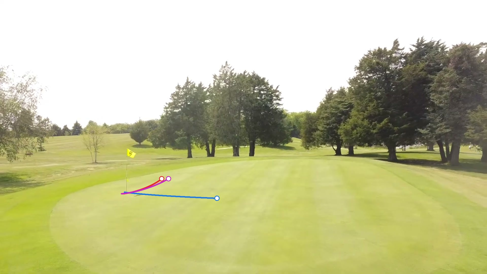

# Sport-Research: Seeing the Break

**Can a camera read a putting green?** This project builds a system that captures
the slope of a golf green from images/depth data, simulates how a ball rolls on it,
and proposes the ideal putting line (aim point + pace).

```
capture (phone video / 3-D camera)  →  3-D height map  →  detect ball & hole
        →  roll simulation  →  ideal line  →  overlay on the image
```

## Status

| Phase | Goal | Status |
|---|---|---|
| 1 | Physics simulator + line solver on synthetic greens | ✅ working |
| 1b | Full pipeline on a real green from an online drone video | ✅ runs end to end, accuracy limited (see below) |
| 2 | Capture a sloped putting mat with known tilt, build height map, compare | ⏳ next |
| 3 | Real green: full pipeline, validated against filmed real putts | ⏳ |

See [docs/PROJECT_PLAN.md](docs/PROJECT_PLAN.md) for the full plan, equipment list
and research questions, and [docs/CAPTURE_GUIDE.md](docs/CAPTURE_GUIDE.md) for how
to film a green.

## Phase 1 results

3 m putt across a 2 % side slope (Stimp 10): aim **28 cm left**, ~53 % make chance
for a typical golfer.


5 m putt over a 6 cm mound on a 1 % uphill (Stimp 11): aim **18 cm left**.
The make/miss map shows how little room there is for error. The solver's
"ideal" line (stop 40 cm past) sits near the edge of the make zone, not its
centre. Choosing the line that maximises margin is an open question for phase 2.


## Phase 1b: a real green from an online drone video

Test of the whole chain (video → 3-D model → height map → ideal line → drawn on the
video) using a freely licensed drone flyover of Leon Golf & Country Club, Iowa
(video 3:05–3:17).



| Step | How | Result |
|---|---|---|
| 3-D model | COLMAP from 96 frames (8 fps), CPU only | 93 frames placed, 32 k points, **293 on the green** |
| Hole + scale | Yellow flag found in 50 frames, triangulated; flag ≈ 1.95 m above the cup | 10.7 m per model unit (drone path 121 m, plausible) |
| Gravity ("down") | Gimbal keeps the camera level sideways → up ⟂ all camera x-axes | ±1.2° (95 %) |
| Surface | Robust quadratic fit | 12 cm scatter; slope 2–5 % |
| Putts | 3 spots, 5 m from the hole | aim 64–89 cm left |

**What this shows:**

- **The pipeline works on real footage.** Every step runs automatically except
  one hand-drawn outline of the green.
- **The predicted lines can't be trusted.** Tilting "down" by just the ±1.2°
  measurement uncertainty moves the aim point by **73–174 cm**. The fitted green
  also falls *away* from the approach at 3–5 %, which is unusual for a real green.
  That's another sign the gravity estimate is off.
- **The main problem is knowing which way is down, not the 3-D shape.** On a
  green, 1° of tilt equals 1.7 % of slope. This is why the capture guide uses
  markers or the phone's tilt sensor, and why a 3-D camera with a motion sensor
  is attractive. It also gives a concrete requirement: **gravity must be known to
  about 0.2° or better.**
- Smooth greens give few 3-D points (only 5 with default settings, 293 after
  tuning). Flying *towards* a green is poor geometry; orbiting it would be better.

Video: "Leon Golf & Country Club, Leon Iowa.. Drone flyover holes 1 thru 9" by
[Idyllic Golfer](https://www.youtube.com/@IdyllicGolfer),
[CC BY 3.0](https://creativecommons.org/licenses/by/3.0/), via
[Wikimedia Commons](https://commons.wikimedia.org/wiki/File:Leon_Golf_%26_Country_Club,_Leon_Iowa.._Drone_flyover_holes_1_thru_9.webm).
Frames and figures in `results/online_video/` are derived from it.

## Quick start

```bash
pip install -r requirements.txt
python3 scripts/demo_phase1.py      # writes figures to results/
python3 -m pytest tests/            # or: python3 tests/test_physics.py

# real-video pipeline (needs ffmpeg + colmap: brew install ffmpeg colmap)
scripts/reconstruct_video.sh VIDEO START_SEC DURATION_SEC WORK_DIR 8
python3 scripts/demo_online_video.py WORK_DIR
```

## Code

| File | What it does |
|---|---|
| `putting/green.py` | Height-map green (synthetic now, from point clouds later), slope lookup, Stimpmeter → friction |
| `putting/physics.py` | Vectorised ball-roll simulation (RK4) and hole-capture model |
| `putting/solver.py` | Finds the aim/speed that holes the putt; make-probability via Monte Carlo |
| `putting/plot.py` | Green map with ideal path, make/miss map |
| `scripts/demo_phase1.py` | Runs the two example scenarios |
| `capture/colmap_model.py` | Reads a COLMAP 3-D model (cameras, poses, points) |
| `capture/flag.py` | Finds the flag in 3-D (yellow blobs + RANSAC triangulation) → hole position and scale |
| `capture/surface.py` | Gravity estimate, levelled metric frame, robust surface fit → `Green` |
| `scripts/reconstruct_video.sh` | Video → frames → COLMAP model |
| `scripts/demo_online_video.py` | Full pipeline on the online drone video |
| `tests/test_capture.py` | Frame maths and surface-fit checks |
| `tests/test_physics.py` | Sanity checks (Stimp distance, straight on flat, breaks uphill, …) |

## Model assumptions (phase 1)

- Ball rolls without slipping: slope acceleration = (5/7)·g·slope (small-slope approximation).
- Grass friction is a constant deceleration set by the Stimpmeter reading
  (a ball at 1.83 m/s rolls the stimp distance on flat ground).
- Ideal line = path through the cup centre that would stop 0.4 m past it.
- Hole capture: the ball must drop one ball radius while crossing the cup
  (max ≈ 1.64 m/s dead-centre). This is a simplified model; lip-outs and rim
  dynamics are not modelled.
- No grain, wind, skid phase, or moisture yet. Golfer error spreads
  (1° aim, 4 % speed) are placeholders to be measured in phase 3.
