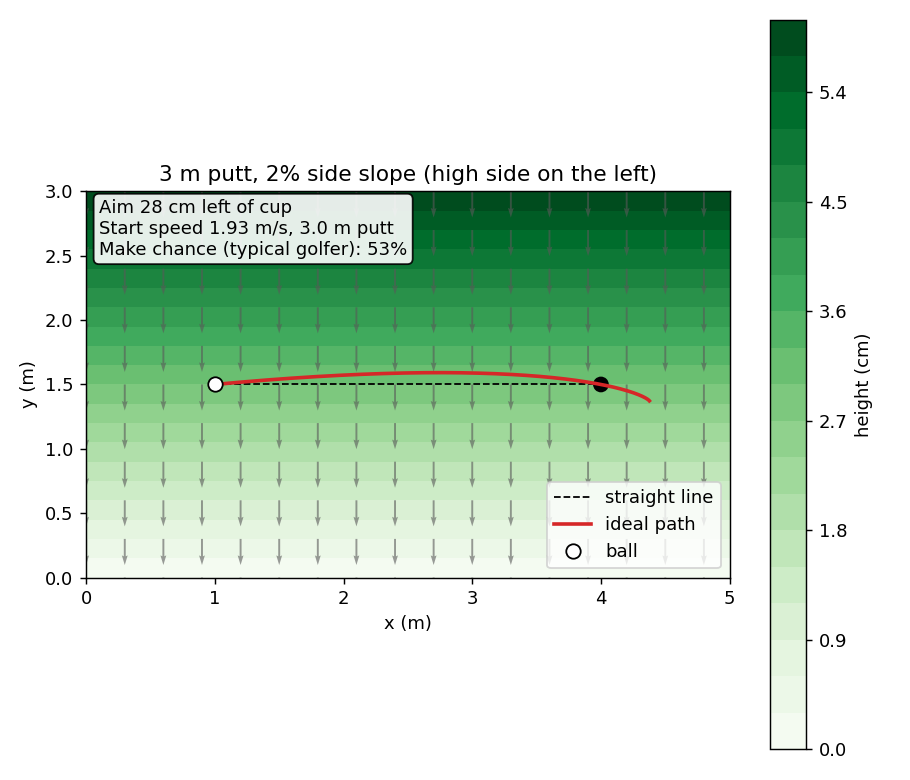
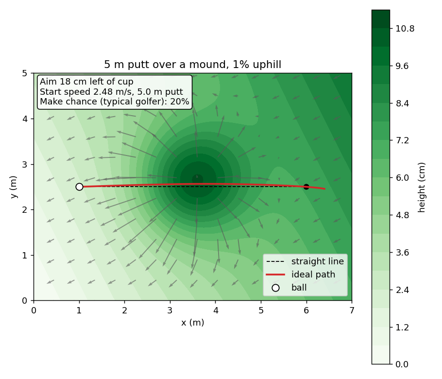
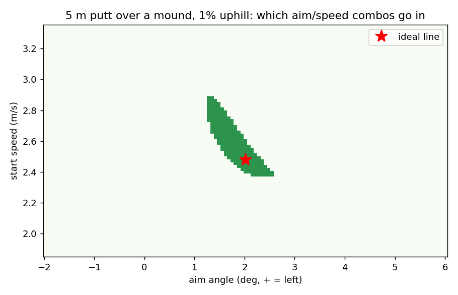

# Sport-Research: Seeing the Break

**Can a camera read a putting green?** This project builds a system that captures
the slope of a golf green from images/depth data, simulates how a ball rolls on it,
and proposes the ideal putting line (aim point + pace).

```
capture (phone LiDAR / video)  →  3-D height map  →  detect ball & hole
        →  roll simulation  →  ideal line  →  overlay on the image
```

## Status

| Phase | Goal | Status |
|---|---|---|
| 1 | Physics simulator + line solver on synthetic greens | ✅ working (this repo) |
| 2 | Capture a sloped putting mat with known tilt, build height map, compare | ⏳ next |
| 3 | Real green: full pipeline, validated against filmed real putts | ⏳ |

See [docs/PROJECT_PLAN.md](docs/PROJECT_PLAN.md) for the full plan, equipment list
and research questions, and [docs/CAPTURE_GUIDE.md](docs/CAPTURE_GUIDE.md) for how
to film a green.

## Phase 1 results

3 m putt across a 2 % side slope (Stimp 10): aim **28 cm left**, ~53 % make chance
for a typical golfer.



5 m putt over a 6 cm mound on a 1 % uphill (Stimp 11): aim **18 cm left**.
The make/miss map shows how little room there is for error. The solver's
"ideal" line (stop 40 cm past) sits near the edge of the make zone, not its
centre. Choosing the line that maximises margin is an open question for phase 2.




## Quick start

```bash
pip install -r requirements.txt
python3 scripts/demo_phase1.py      # writes figures to results/
python3 -m pytest tests/            # or: python3 tests/test_physics.py
```

## Code

| File | What it does |
|---|---|
| `putting/green.py` | Height-map green (synthetic now, from point clouds later), slope lookup, Stimpmeter → friction |
| `putting/physics.py` | Vectorised ball-roll simulation (RK4) and hole-capture model |
| `putting/solver.py` | Finds the aim/speed that holes the putt; make-probability via Monte Carlo |
| `putting/plot.py` | Green map with ideal path, make/miss map |
| `scripts/demo_phase1.py` | Runs the two example scenarios |
| `tests/test_physics.py` | Sanity checks (Stimp distance, straight on flat, breaks uphill, …) |

## Model assumptions (phase 1)

- Ball rolls without slipping: slope acceleration = (5/7)·g·slope (small-slope approximation).
- Grass friction is a constant deceleration set by the Stimpmeter reading
  (a ball at 1.83 m/s rolls the stimp distance on flat ground).
- Ideal line = path through the cup centre that would stop 0.4 m past it.
- Hole capture: the ball must drop one ball radius while crossing the cup
  (max ≈ 1.64 m/s dead-centre). This is a simplified model; lip-outs and rim
  dynamics are not modelled.
- No grain, wind, skid phase, or moisture yet. Golfer error spreads
  (1° aim, 4 % speed) are placeholders to be measured in phase 3.
